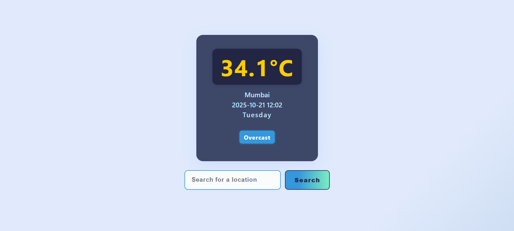
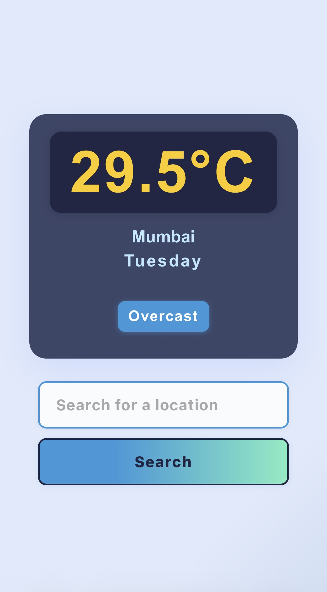

# ☀️ Weather App

A modern, responsive weather app built with HTML, CSS, and JavaScript. Quickly view live weather for any city using WeatherAPI: temperature, date/time, weekday, and condition—all in a beautiful, mobile-ready interface.


---
## Screenshots

**Desktop view:**  


**Mobile view:**  


---

## Features

- **Live weather info:** Instantly see temperature, city, weather condition, date, and day for any location.
- **Search any city:** Fast, accurate location search powered by WeatherAPI.
- **Responsive design:** Works seamlessly on desktop, tablet, and mobile devices.
- **Stylish UI:** Clean layout, clear fonts, bold colors, and custom favicon.
- **Portfolio-ready:** Easy to customize and deploy, ideal for showcasing modern web skills.

---

## Getting Started

1. **Clone the repository:**
    ```
    git clone https://github.com/Cyriljaiswal/weather-app.git
    cd weather-app
    ```
2. **Add your WeatherAPI key** inside `script.js` (replace the `key` parameter).
3. **Open `index.html`** in your browser.

---

## Folder Structure

weather-app/
├── index.html
├── style.css
├── script.js
├── images/
│ ├── favicon.ico
│ └── favicon.jpg
└── README.md

---

## Deployment

- Use [GitHub Pages](https://pages.github.com/) for free, live hosting.
- In your repo: Settings → Pages → Source (select branch and `/root`).
- Your app will be live at:  
  `https://Cyriljaiswal.github.io/weather-app/`

---

## Credits

- **WeatherAPI** for live weather data.
- Favicon: Your own `images/favicon.ico` & `images/favicon.jpg`
- Built by [Cyril Jaiswal](https://github.com/Cyriljaiswal)

---

**Contact:**  
[LinkedIn](https://www.linkedin.com/in/cyriljaiswal) • [GitHub](https://github.com/Cyriljaiswal)

